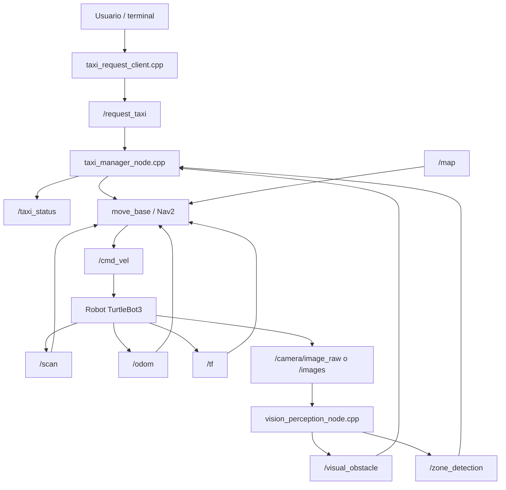
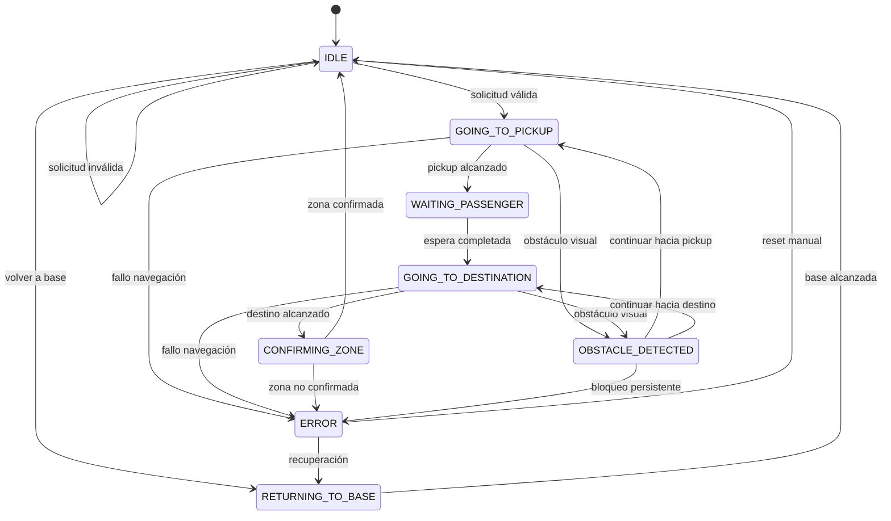

# MWC TaxiBot

## Taxi autónomo indoor basado en ROS para un entorno ferial tecnológico

Este documento presenta una primera versión completa de la idea de proyecto **MWC TaxiBot**, un sistema de robótica móvil autónoma basado en ROS para simular un servicio de taxi indoor dentro de un entorno inspirado en el **Mobile World Congress**.

La propuesta combina navegación autónoma, sensores, percepción visual y una capa propia de decisión programada en C++. El objetivo no es construir un taxi urbano real ni transportar personas físicamente, sino diseñar e implementar una versión robótica a escala capaz de representar el funcionamiento de un servicio autónomo de movilidad interior.

---

## 1. Idea general del proyecto

**MWC TaxiBot** consiste en el diseño, simulación e implementación de un robot móvil autónomo que actúa como un servicio de taxi dentro de un recinto ferial tecnológico.

El robot será capaz de:

1. Permanecer disponible en una zona base.
2. Recibir una solicitud de trayecto.
3. Validar el punto de recogida y el destino.
4. Navegar autónomamente hasta el punto de recogida.
5. Esperar unos segundos para simular la subida del usuario.
6. Navegar hasta el destino solicitado.
7. Confirmar la llegada al destino.
8. Finalizar el servicio.
9. Volver a la base o quedar disponible para una nueva petición.

El proyecto se apoya en los conceptos trabajados en la asignatura:

- ROS.
- Nodos.
- Topics.
- Services.
- Launch files.
- TurtleBot3.
- Gazebo.
- RViz.
- `/cmd_vel`.
- `/scan`.
- `/odom`.
- `/tf`.
- `/map`.
- SLAM.
- Localización.
- Navegación autónoma.
- Planificación de trayectorias.
- Evitación de obstáculos.
- Percepción con cámara.

La parte diferencial del proyecto será una capa lógica propia que convierte la navegación básica entre puntos en un servicio de taxi indoor con estados, solicitudes, validaciones, espera de pasajero, detección de errores y seguimiento del servicio.

---

## 2. Contexto: Mobile World Congress

El Mobile World Congress es un evento tecnológico de gran escala que reúne empresas, visitantes, stands, pabellones, auditorios, demostraciones, zonas de networking y espacios de servicios.

Este tipo de entorno justifica muy bien un robot móvil autónomo porque:

- Es un espacio interior grande.
- Tiene múltiples zonas de interés.
- Los visitantes pueden necesitar orientación.
- Hay rutas repetitivas entre puntos importantes.
- Puede haber aglomeraciones y obstáculos dinámicos.
- La organización del recinto se puede representar mediante un mapa.
- Un robot puede acompañar visitantes, guiar usuarios o transportar objetos pequeños.

En este contexto, el robot no se plantea como un vehículo real para transportar personas, sino como una maqueta funcional del servicio:

- El "pasajero" se simula mediante una espera en el punto de recogida.
- Las zonas del MWC se representan mediante coordenadas del mapa.
- El robot se desplaza autónomamente entre zonas.
- La cámara puede reconocer elementos visuales o confirmar zonas.
- El LiDAR se usa para navegación segura y evitación de obstáculos.

---

## 3. Objetivo principal

El objetivo principal del proyecto es demostrar la integración de **navegación autónoma**, **percepción visual** y **gestión inteligente de comportamiento** dentro de ROS.

El valor del proyecto no está únicamente en mover el robot de un punto A a un punto B, sino en construir un sistema que funcione como una aplicación robótica completa:

- Recibe peticiones.
- Comprueba si puede aceptarlas.
- Gestiona el estado del robot.
- Envía objetivos de navegación.
- Supervisa la ejecución del servicio.
- Espera al pasajero.
- Reacciona ante obstáculos.
- Confirma zonas de llegada.
- Informa del estado actual.
- Finaliza correctamente cada trayecto.

---

## 4. Objetivos específicos

Los objetivos específicos del proyecto son:

1. Diseñar un entorno ferial simplificado inspirado en el Mobile World Congress.
2. Definir zonas de interés dentro del mapa.
3. Crear una arquitectura ROS modular basada en varios nodos.
4. Implementar un nodo principal `taxi_manager_node.cpp`.
5. Implementar un sistema de solicitud de trayectos mediante un servicio ROS.
6. Publicar el estado del taxi en un topic propio.
7. Integrar la navegación autónoma usando `move_base` o Nav2, según la versión disponible.
8. Usar el LiDAR como sensor principal para seguridad y obstáculos.
9. Usar la cámara como capa adicional de percepción visual.
10. Probar el sistema en simulación.
11. Adaptar la demo a un espacio real reducido.
12. Preparar una demostración final clara, repetible y alineada con la asignatura.

---

## 5. Alcance del proyecto

### 5.1. Qué sí incluye

El proyecto incluye:

- Un robot móvil simulado o real basado en TurtleBot3.
- Un mapa del entorno.
- Zonas de interés predefinidas.
- Solicitudes de trayecto.
- Navegación autónoma entre zonas.
- Máquina de estados del servicio de taxi.
- Publicación del estado del servicio.
- Percepción visual básica.
- Detección de obstáculos relevantes.
- Simulación en Gazebo/RViz.
- Posible ejecución en robot físico.
- Demo final con trayecto completo.

### 5.2. Qué no incluye

El proyecto no incluye:

- Transporte real de personas.
- Un taxi urbano real.
- Planificación global creada desde cero.
- Reconocimiento facial.
- Sistema complejo de reservas.
- Interfaz gráfica avanzada obligatoria.
- Mapas de un recinto real completo del MWC.
- Control manual directo de motores desde el nodo principal.

La filosofía será aprovechar el stack de navegación de ROS para la parte de movimiento y construir encima una capa propia de lógica de servicio.

---

## 6. Plataforma robótica prevista

La plataforma de referencia será **TurtleBot3**, especialmente:

- TurtleBot3 Burger para simulaciones o prácticas previas.
- TurtleBot3 Waffle Pi si se usa el robot indicado en el proyecto final.

El robot tendrá los elementos principales:

| Elemento | Función |
|---|---|
| Base móvil diferencial | Permite desplazamiento lineal y giro |
| LiDAR | Detección de obstáculos y navegación |
| Cámara | Percepción visual y confirmación de zonas |
| Odometría | Estimación del movimiento del robot |
| ROS | Comunicación entre nodos |
| Gazebo | Simulación física |
| RViz | Visualización de mapa, sensores y objetivos |

---

## 7. Entorno ferial propuesto

El entorno simulado representará un pabellón simplificado del Mobile World Congress.

El mapa tendrá varias zonas:

| Zona | Descripción |
|---|---|
| `base` | Punto inicial del robot y zona de descanso |
| `entrada` | Entrada principal del pabellón |
| `auditorio` | Zona de conferencias o presentaciones |
| `stand_robotica` | Stand tecnológico de robótica |
| `cafeteria` | Zona de descanso o comida |
| `networking` | Zona de reuniones y networking |
| `servicios` | Zona auxiliar opcional |

Cada zona tendrá coordenadas asociadas dentro del mapa:

```text
base            -> x, y, theta
entrada         -> x, y, theta
auditorio       -> x, y, theta
stand_robotica  -> x, y, theta
cafeteria       -> x, y, theta
networking      -> x, y, theta
```

Estas coordenadas se podrán definir inicialmente dentro del código o en un fichero de configuración YAML.

---

## 8. Representación física de la demo

En la simulación, el entorno podrá tener forma de pabellón con pasillos, zonas de parada y obstáculos.

En el robot real, el entorno se puede adaptar a un espacio reducido:

| Zona MWC | Representación real |
|---|---|
| Entrada principal | Puerta del aula o inicio del pasillo |
| Auditorio | Esquina o zona marcada con cartel |
| Stand de robótica | Mesa con cartel o elemento tecnológico |
| Cafetería | Mesa o zona señalizada |
| Networking | Espacio abierto marcado |
| Base | Punto inicial del robot |

La idea es que la demo real sea proporcional y viable. No hace falta recrear un pabellón completo, sino representar conceptualmente las zonas importantes.

---

## 9. Arquitectura general del sistema

La arquitectura se dividirá en varios niveles:

1. **Nivel de usuario**
   - Envía solicitudes de trayecto.
   - Consulta el estado del taxi.

2. **Nivel de gestión**
   - Controla la lógica del servicio.
   - Mantiene la máquina de estados.
   - Decide cuándo aceptar o rechazar trayectos.

3. **Nivel de navegación**
   - Calcula rutas.
   - Evita obstáculos.
   - Envía velocidades al robot.

4. **Nivel de percepción**
   - Lee cámara.
   - Detecta objetos o señales.
   - Publica eventos visuales.

5. **Nivel de sensores y robot**
   - LiDAR.
   - Odometría.
   - Cámara.
   - Control de movimiento.



---

## 10. Nodos principales

### 10.1. `taxi_manager_node.cpp`

Será el nodo principal del proyecto.

Responsabilidades:

- Mantener el estado actual del taxi.
- Recibir solicitudes de trayecto.
- Validar zonas de recogida y destino.
- Comprobar si el robot está libre.
- Enviar objetivos de navegación.
- Esperar al pasajero.
- Supervisar llegada a pickup y destino.
- Recibir alertas visuales.
- Publicar el estado actual.
- Gestionar errores.
- Decidir si vuelve a base o queda libre.

Este nodo no se encargará directamente de mover las ruedas. No publicará velocidades manualmente en `/cmd_vel` salvo que se decida incluir una parada de seguridad muy simple. Lo normal es que envíe objetivos a `move_base` o Nav2 y deje que el sistema de navegación gestione el movimiento.

### 10.2. `vision_perception_node.cpp`

Será el nodo encargado de procesar la información de la cámara.

Responsabilidades:

- Suscribirse a la imagen de la cámara.
- Ejecutar una detección visual simple.
- Detectar elementos relevantes.
- Publicar obstáculos visuales.
- Confirmar señales o zonas.
- Ayudar a validar que el robot ha llegado al punto correcto.

La percepción puede implementarse en varios niveles:

1. Detección por color o forma.
2. Detección de señales simples.
3. Modelo ligero tipo FOMO o YOLO reducido.
4. Clasificación básica de zonas mediante carteles.

Para una primera versión realista, conviene empezar por señales visuales simples antes de depender completamente de un modelo complejo.

### 10.3. `taxi_request_client.cpp`

Será un nodo cliente para enviar solicitudes.

Responsabilidades:

- Permitir solicitar trayectos desde terminal.
- Enviar pickup y destino al servicio `/request_taxi`.
- Mostrar si la solicitud ha sido aceptada o rechazada.

Ejemplo conceptual:

```bash
rosrun mwc_taxibot taxi_request_client entrada auditorio
```

Respuesta esperada:

```text
Solicitud aceptada: taxi enviado desde entrada hasta auditorio
```

### 10.4. Nodo de navegación

No será programado desde cero. Se usará el stack disponible:

- `move_base` en ROS 1.
- Nav2 en ROS 2, si se trabaja con esa versión.

En el contexto de la asignatura, lo más probable es usar **ROS 1 con `move_base`**, porque las prácticas trabajan con `roscore`, `roslaunch`, `catkin_make`, TurtleBot3 y navegación clásica.

Funciones:

- Recibir objetivos.
- Calcular trayectoria global.
- Calcular velocidades locales.
- Evitar obstáculos.
- Publicar en `/cmd_vel`.
- Usar mapa, costmaps, LiDAR, odometría y TF.

---

## 11. Topics principales

| Topic | Tipo aproximado | Productor | Consumidor | Uso |
|---|---|---|---|---|
| `/cmd_vel` | `geometry_msgs/Twist` | `move_base` | Robot | Velocidad lineal y angular |
| `/scan` | `sensor_msgs/LaserScan` | LiDAR | Navegación / seguridad | Obstáculos |
| `/odom` | `nav_msgs/Odometry` | Robot | Navegación | Odometría |
| `/tf` | `tf/tfMessage` | Robot / TF | Todo el sistema | Transformaciones |
| `/map` | `nav_msgs/OccupancyGrid` | `map_server` | Navegación / RViz | Mapa |
| `/amcl_pose` | `geometry_msgs/PoseWithCovarianceStamped` | AMCL | Taxi manager / RViz | Pose estimada |
| `/move_base/goal` | `MoveBaseActionGoal` | Taxi manager | `move_base` | Objetivos |
| `/move_base/status` | `GoalStatusArray` | `move_base` | Taxi manager | Estado navegación |
| `/taxi_status` | `std_msgs/String` o msg propio | Taxi manager | Usuario / RViz | Estado del servicio |
| `/visual_obstacle` | `std_msgs/Bool` o msg propio | Percepción | Taxi manager | Obstáculo visual |
| `/zone_detection` | `std_msgs/String` o msg propio | Percepción | Taxi manager | Zona detectada |
| `/camera/image_raw` | `sensor_msgs/Image` | Cámara | Percepción | Imagen |
| `/images` | `sensor_msgs/Image` | Cámara | Percepción | Topic de imagen indicado en el enunciado |

---

## 12. Servicios principales

### 12.1. `/request_taxi`

Servicio propio para solicitar un trayecto.

Entrada:

```text
string pickup_zone
string destination_zone
```

Salida:

```text
bool accepted
string message
```

Ejemplos de solicitud válida:

```text
pickup_zone: entrada
destination_zone: auditorio
```

Respuesta:

```text
accepted: true
message: "Solicitud aceptada. Taxi enviado a entrada con destino auditorio."
```

Ejemplo de solicitud rechazada:

```text
pickup_zone: entrada
destination_zone: zona_inexistente
```

Respuesta:

```text
accepted: false
message: "Destino no encontrado en el mapa."
```

### 12.2. Posibles servicios auxiliares

Más adelante se podrían añadir:

| Servicio | Uso |
|---|---|
| `/cancel_taxi` | Cancelar trayecto actual |
| `/return_to_base` | Forzar vuelta a base |
| `/list_zones` | Consultar zonas disponibles |
| `/reset_taxi_state` | Recuperar estado tras error |

Para la primera versión, `/request_taxi` es suficiente.

---

## 13. Máquina de estados

La lógica interna del taxi se basará en una máquina de estados.

Estados propuestos:

| Estado | Significado |
|---|---|
| `IDLE` | Taxi disponible |
| `GOING_TO_PICKUP` | Navegando al punto de recogida |
| `WAITING_PASSENGER` | Esperando al pasajero |
| `GOING_TO_DESTINATION` | Navegando al destino |
| `CONFIRMING_ZONE` | Confirmando visualmente la zona |
| `OBSTACLE_DETECTED` | Obstáculo visual relevante detectado |
| `RETURNING_TO_BASE` | Volviendo a base |
| `ERROR` | Error o fallo de navegación |

Diagrama de estados:



---

## 14. Flujo de funcionamiento

### 14.1. Inicio del sistema

1. Se lanza ROS.
2. Se carga el robot.
3. Se carga el mapa.
4. Se inicia localización.
5. Se inicia navegación.
6. Se inicia `taxi_manager_node.cpp`.
7. Se inicia `vision_perception_node.cpp`.
8. El taxi publica estado `IDLE`.

### 14.2. Solicitud de trayecto

1. El usuario solicita un trayecto.
2. El cliente llama al servicio `/request_taxi`.
3. El taxi manager recibe pickup y destino.
4. Comprueba si el taxi está libre.
5. Comprueba si las zonas existen.
6. Si todo es válido, acepta.
7. Cambia a `GOING_TO_PICKUP`.

### 14.3. Recogida

1. El taxi manager envía objetivo de navegación al pickup.
2. `move_base` calcula y ejecuta la ruta.
3. El robot navega usando mapa, LiDAR, odometría y TF.
4. Al llegar, el taxi manager cambia a `WAITING_PASSENGER`.
5. Espera unos segundos.
6. Publica un mensaje de recogida completada.

### 14.4. Trayecto al destino

1. El taxi manager envía el objetivo del destino.
2. El robot navega hasta la zona indicada.
3. Si aparece un obstáculo, la navegación local intenta evitarlo.
4. Si la cámara detecta un obstáculo relevante, se publica una alerta.
5. El taxi manager puede esperar, mantener el objetivo o solicitar replanificación.

### 14.5. Llegada

1. El robot llega al destino.
2. El taxi manager cambia a `CONFIRMING_ZONE`.
3. La cámara intenta confirmar la señal visual de la zona.
4. Si la zona se confirma, el servicio termina correctamente.
5. El taxi queda `IDLE` o vuelve a `base`.

---

## 15. Gestión de zonas

El sistema tendrá una tabla interna de zonas.

Ejemplo:

```cpp
struct Zone
{
    std::string name;
    double x;
    double y;
    double yaw;
    std::string expected_visual_label;
};
```

Ejemplo de zonas:

| Nombre | x | y | yaw | Señal esperada |
|---|---:|---:|---:|---|
| `base` | 0.0 | 0.0 | 0.0 | `BASE` |
| `entrada` | 1.5 | 0.0 | 0.0 | `ENTRADA` |
| `auditorio` | 4.0 | 2.0 | 1.57 | `AUDITORIO` |
| `stand_robotica` | 2.0 | 3.0 | 0.0 | `ROBOTICA` |
| `cafeteria` | -1.0 | 2.5 | 3.14 | `CAFE` |
| `networking` | 3.0 | -1.5 | -1.57 | `NETWORKING` |

En una primera versión, las zonas pueden estar definidas dentro del código. Una mejora natural sería cargarlas desde un fichero YAML:

```yaml
zones:
  base:
    x: 0.0
    y: 0.0
    yaw: 0.0
    label: BASE
  entrada:
    x: 1.5
    y: 0.0
    yaw: 0.0
    label: ENTRADA
  auditorio:
    x: 4.0
    y: 2.0
    yaw: 1.57
    label: AUDITORIO
```

---

## 16. Percepción visual

La percepción visual no será el mecanismo principal de navegación. El sensor principal para moverse de forma segura será el LiDAR.

La cámara se usará como una capa adicional para:

- Detectar personas.
- Detectar sillas.
- Detectar mochilas o maletas.
- Detectar cajas.
- Detectar conos.
- Confirmar señales visuales de zonas.
- Mejorar la interpretación del entorno.

### 16.1. Posibles enfoques

#### Opción A: detección simple por color o forma

Ventajas:

- Fácil de implementar.
- Rápida.
- No requiere entrenamiento.
- Adecuada para señales visuales preparadas.

Inconvenientes:

- Poco robusta ante cambios de luz.
- Limitada a señales simples.

#### Opción B: modelo ligero tipo FOMO

Ventajas:

- Pensado para detección ligera.
- Puede funcionar bien en hardware limitado.
- Adecuado para objetos simples.

Inconvenientes:

- Requiere preparar ejemplos o modelo.
- Puede necesitar integración adicional.

#### Opción C: YOLO ligero

Ventajas:

- Más potente.
- Puede detectar clases comunes.
- Da una demo más atractiva.

Inconvenientes:

- Puede ser pesado.
- Puede complicar la integración.
- Depende más del hardware.

### 16.2. Recomendación para la primera versión

La primera versión debería priorizar robustez:

1. LiDAR y navegación como base obligatoria.
2. Señales visuales simples para confirmar zonas.
3. Detección visual de obstáculos como mejora.
4. YOLO ligero como extra si hay tiempo y rendimiento suficiente.

De esta forma, el proyecto no depende totalmente de la visión artificial para funcionar.

---

## 17. Integración con navegación ROS

El taxi manager no debe sustituir al stack de navegación.

La división correcta será:

| Componente | Responsabilidad |
|---|---|
| `taxi_manager_node.cpp` | Decide a dónde ir y en qué estado está el servicio |
| `move_base` / Nav2 | Calcula cómo llegar evitando obstáculos |
| LiDAR | Informa obstáculos |
| Costmaps | Representan zonas ocupadas |
| Local planner | Genera velocidades |
| `/cmd_vel` | Topic final de movimiento |

El taxi manager enviará goals al sistema de navegación.

En ROS 1, esto se puede hacer con `actionlib` y `move_base_msgs/MoveBaseAction`.

Conceptualmente:

```cpp
move_base_msgs::MoveBaseGoal goal;
goal.target_pose.header.frame_id = "map";
goal.target_pose.header.stamp = ros::Time::now();
goal.target_pose.pose.position.x = zone.x;
goal.target_pose.pose.position.y = zone.y;
goal.target_pose.pose.orientation = createQuaternionFromYaw(zone.yaw);
client.sendGoal(goal);
```

---

## 18. Seguridad y obstáculos

La seguridad del movimiento dependerá principalmente de:

- `/scan`.
- Costmap local.
- Costmap global.
- Planner local.
- Inflación de obstáculos.
- Replanificación.

La cámara añadirá eventos de alto nivel.

Ejemplo:

```text
vision_perception_node detecta "persona delante"
          |
          v
publica /visual_obstacle = true
          |
          v
taxi_manager_node cambia temporalmente a OBSTACLE_DETECTED
          |
          v
espera, mantiene objetivo o solicita replanificación
```

No se pretende crear un algoritmo completo de evitación de obstáculos desde cero. Esa parte la debe hacer `move_base` o Nav2.

La contribución propia estará en la reacción lógica:

- Esperar si hay una persona bloqueando.
- Informar del bloqueo.
- Reintentar tras unos segundos.
- Cancelar si el bloqueo persiste.
- Volver a base si hay error grave.

---

## 19. Estados publicados en `/taxi_status`

El topic `/taxi_status` permitirá seguir el comportamiento del robot.

Estados posibles:

```text
IDLE
REQUEST_ACCEPTED
REQUEST_REJECTED
GOING_TO_PICKUP
ARRIVED_AT_PICKUP
WAITING_PASSENGER
GOING_TO_DESTINATION
VISUAL_OBSTACLE_DETECTED
REPLANNING
ARRIVED_AT_DESTINATION
CONFIRMING_ZONE
SERVICE_COMPLETED
RETURNING_TO_BASE
ERROR
```

Ejemplos de mensajes:

```text
Taxi disponible en base
Solicitud aceptada: entrada -> auditorio
Dirigiéndose al punto de recogida: entrada
Pasajero recogido. Dirigiéndose a auditorio
Obstáculo visual detectado. Esperando replanificación
Destino alcanzado: auditorio
Servicio completado
```

En una primera implementación se puede usar `std_msgs/String`. Si se quiere una solución más ordenada, se puede crear un mensaje propio:

```text
string state
string pickup_zone
string destination_zone
string message
bool busy
```

---

## 20. Solicitudes válidas e inválidas

El sistema debe validar cada petición.

Una solicitud será válida si:

- El taxi está en `IDLE`.
- El pickup existe.
- El destino existe.
- Pickup y destino no son iguales.
- El sistema de navegación está disponible.

Una solicitud será rechazada si:

- El taxi está ocupado.
- La zona de recogida no existe.
- El destino no existe.
- El robot está en error.
- No hay mapa cargado.
- No hay localización válida.

Ejemplos:

| Solicitud | Resultado |
|---|---|
| `entrada -> auditorio` | Aceptada |
| `base -> cafeteria` | Aceptada |
| `entrada -> entrada` | Rechazada |
| `zona_x -> auditorio` | Rechazada |
| `entrada -> auditorio` con taxi ocupado | Rechazada |

---

## 21. Simulación

La simulación será una parte clave del proyecto porque permite probar el sistema antes de llevarlo al robot real.

Herramientas:

- Gazebo.
- RViz.
- TurtleBot3.
- Mapa del entorno.
- `move_base`.
- AMCL.
- `map_server`.

Escenarios de prueba:

1. Trayecto simple sin obstáculos.
2. Trayecto con obstáculo estático.
3. Trayecto con obstáculo dinámico.
4. Solicitud inválida.
5. Taxi ocupado.
6. Llegada a zona con confirmación visual.
7. Error de navegación.
8. Vuelta a base.

Entorno simulado:

- Pasillos.
- Paredes.
- Stands.
- Zonas marcadas.
- Obstáculos.
- Señales visuales.

---

## 22. Implementación real

La implementación real se adaptará a un espacio pequeño.

Posible configuración:

| Elemento | Solución práctica |
|---|---|
| Mapa | Mapa creado con SLAM en aula/pasillo |
| Zonas | Puntos físicos marcados |
| Señales | Carteles de colores o texto grande |
| Obstáculos | Cajas, sillas, mochilas |
| Pasajero | Espera simulada |
| Destino | Zona marcada |

La prioridad será que la demo sea fiable:

1. Robot localizado.
2. Mapa cargado.
3. Navegación entre dos puntos funcional.
4. Servicio `/request_taxi` funcionando.
5. Estados publicados.
6. Percepción visual básica integrada.
7. Demo final repetible.

---

## 23. Paquete ROS propuesto

Nombre del paquete:

```text
mwc_taxibot
```

Estructura propuesta:

```text
mwc_taxibot/
├── CMakeLists.txt
├── package.xml
├── launch/
│   ├── mwc_taxibot_sim.launch
│   ├── mwc_taxibot_real.launch
│   └── taxi_manager.launch
├── src/
│   ├── taxi_manager_node.cpp
│   ├── taxi_request_client.cpp
│   └── vision_perception_node.cpp
├── srv/
│   └── RequestTaxi.srv
├── msg/
│   └── TaxiStatus.msg
├── config/
│   ├── zones.yaml
│   └── taxi_params.yaml
├── maps/
│   ├── mwc_map.yaml
│   └── mwc_map.pgm
├── worlds/
│   └── mwc_pavilion.world
└── README.md
```

---

## 24. Archivos de configuración

### 24.1. `zones.yaml`

Contendrá las zonas del entorno.

```yaml
zones:
  base:
    x: 0.0
    y: 0.0
    yaw: 0.0
    visual_label: BASE

  entrada:
    x: 1.5
    y: 0.0
    yaw: 0.0
    visual_label: ENTRADA

  auditorio:
    x: 4.0
    y: 2.0
    yaw: 1.57
    visual_label: AUDITORIO

  stand_robotica:
    x: 2.0
    y: 3.0
    yaw: 0.0
    visual_label: ROBOTICA

  cafeteria:
    x: -1.0
    y: 2.5
    yaw: 3.14
    visual_label: CAFE
```

### 24.2. `taxi_params.yaml`

Contendrá parámetros generales.

```yaml
pickup_wait_time: 5.0
zone_confirmation_timeout: 4.0
obstacle_wait_time: 3.0
max_obstacle_retries: 3
return_to_base_after_service: true
base_zone: base
status_publish_rate: 2.0
```

---

## 25. Servicio `RequestTaxi.srv`

Definición propuesta:

```text
string pickup_zone
string destination_zone
---
bool accepted
string message
```

Uso desde terminal:

```bash
rosservice call /request_taxi "pickup_zone: 'entrada'
destination_zone: 'auditorio'"
```

Respuesta:

```text
accepted: True
message: "Solicitud aceptada: entrada -> auditorio"
```

---

## 26. Mensaje `TaxiStatus.msg`

Primera versión:

```text
string state
string current_zone
string pickup_zone
string destination_zone
string message
bool busy
```

Ejemplo:

```text
state: "GOING_TO_DESTINATION"
current_zone: "entrada"
pickup_zone: "entrada"
destination_zone: "auditorio"
message: "Pasajero recogido. Navegando hacia auditorio."
busy: true
```

Si no se quiere crear un mensaje propio, se puede usar inicialmente `std_msgs/String`.

---

## 27. Launch files

### 27.1. `mwc_taxibot_sim.launch`

Lanzaría:

- Gazebo.
- TurtleBot3.
- Mundo del MWC.
- `map_server`.
- AMCL.
- `move_base`.
- `taxi_manager_node`.
- `vision_perception_node`.

### 27.2. `taxi_manager.launch`

Lanzaría solo la lógica del taxi:

```xml
<launch>
    <node pkg="mwc_taxibot" type="taxi_manager_node" name="taxi_manager_node" output="screen">
        <rosparam file="$(find mwc_taxibot)/config/zones.yaml" command="load" />
        <rosparam file="$(find mwc_taxibot)/config/taxi_params.yaml" command="load" />
    </node>
</launch>
```

### 27.3. `mwc_taxibot_real.launch`

Lanzaría los nodos necesarios para el robot físico, suponiendo que el bringup del robot ya está activo.

---

## 28. Comandos previstos

### 28.1. Compilar

```bash
cd ~/catkin_ws
catkin_make
source devel/setup.bash
```

### 28.2. Lanzar simulación TurtleBot3

```bash
export TURTLEBOT3_MODEL=waffle_pi
roslaunch turtlebot3_gazebo turtlebot3_world.launch
```

### 28.3. Lanzar navegación

```bash
roslaunch turtlebot3_navigation turtlebot3_navigation.launch map_file:=$HOME/map.yaml
```

### 28.4. Lanzar TaxiBot

```bash
roslaunch mwc_taxibot taxi_manager.launch
```

### 28.5. Solicitar taxi

```bash
rosrun mwc_taxibot taxi_request_client entrada auditorio
```

o:

```bash
rosservice call /request_taxi "pickup_zone: 'entrada'
destination_zone: 'auditorio'"
```

### 28.6. Ver estado

```bash
rostopic echo /taxi_status
```

### 28.7. Ver sensores

```bash
rostopic echo /scan
rostopic echo /odom
rostopic echo /tf
rostopic echo /camera/image_raw
```

### 28.8. Visualizar grafo ROS

```bash
rqt_graph
```

---

## 29. Relación con lo trabajado en la asignatura

El proyecto se conecta directamente con las prácticas:

| Contenido de clase | Aplicación en MWC TaxiBot |
|---|---|
| Nodos ROS | `taxi_manager_node`, `vision_perception_node`, cliente |
| Topics | `/scan`, `/cmd_vel`, `/odom`, `/map`, `/taxi_status` |
| Services | `/request_taxi` |
| Launch files | Lanzamiento del sistema completo |
| TurtleBot3 | Plataforma móvil |
| Gazebo | Simulación del entorno ferial |
| RViz | Visualización de mapa, robot y objetivos |
| SLAM | Creación del mapa del entorno |
| `map_server` | Carga del mapa |
| AMCL | Localización |
| `move_base` | Navegación autónoma |
| LaserScan | Detección de obstáculos |
| Cámara | Percepción visual |
| C++ | Implementación de nodos principales |

Además, aprovecha la práctica de topics y `/scan`, donde ya se trabajó con lectura del láser y publicación en `/cmd_vel`, pero la lleva a un nivel más alto: en vez de controlar directamente las velocidades, el proyecto usa navegación autónoma y añade gestión de servicio.

---

## 30. Diferencia respecto a una navegación simple

Una navegación simple consiste en enviar un objetivo al robot y esperar que llegue.

MWC TaxiBot añade:

- Solicitudes de usuario.
- Validación de trayectos.
- Estados del servicio.
- Espera de pasajero.
- Confirmación de destino.
- Integración de cámara.
- Gestión de obstáculos visuales.
- Mensajes de estado.
- Posible retorno a base.
- Contexto de aplicación realista.

Esto convierte el proyecto en un sistema completo y no solo en una demo de `move_base`.

---

## 31. Demo final propuesta

La demo final puede seguir este guion:

1. El robot empieza en `base`.
2. El sistema muestra estado `IDLE`.
3. Un usuario solicita:

```text
entrada -> auditorio
```

4. El taxi acepta la solicitud.
5. El robot navega hasta `entrada`.
6. Al llegar, publica `WAITING_PASSENGER`.
7. Espera 5 segundos.
8. Publica que el pasajero ha subido.
9. Navega hacia `auditorio`.
10. Durante el trayecto aparece un obstáculo.
11. El LiDAR o la cámara detectan la situación.
12. El sistema espera o permite replanificación.
13. El robot continúa.
14. Llega a `auditorio`.
15. La cámara confirma la zona.
16. El servicio finaliza.
17. El taxi queda disponible o vuelve a `base`.

Este guion permite mostrar todos los elementos importantes:

- Servicio ROS.
- Máquina de estados.
- Navegación autónoma.
- Sensores.
- Percepción visual.
- Reacción ante obstáculos.
- Estado publicado.
- Aplicación contextualizada.

---

## 32. Riesgos técnicos

| Riesgo | Impacto | Mitigación |
|---|---|---|
| La navegación no es estable | Alto | Probar primero con pocos puntos y mapa simple |
| AMCL no localiza bien | Alto | Usar buen mapa, pose inicial correcta y RViz |
| La visión artificial falla | Medio | Hacer que sea capa adicional, no obligatoria |
| YOLO es demasiado pesado | Medio | Usar detección simple o modelo ligero |
| Obstáculos bloquean el robot | Medio | Añadir timeout y reintentos |
| Coordenadas mal definidas | Medio | Medir puntos en RViz y guardarlos en YAML |
| Integración con robot real consume tiempo | Alto | Validar todo en simulación primero |
| El alcance crece demasiado | Alto | Priorizar demo mínima funcional |

---

## 33. Versión mínima viable

La versión mínima viable debería incluir:

1. Mapa cargado.
2. Robot localizado.
3. Zonas definidas.
4. Servicio `/request_taxi`.
5. `taxi_manager_node.cpp`.
6. Envío de goals a `move_base`.
7. Estados `IDLE`, `GOING_TO_PICKUP`, `WAITING_PASSENGER`, `GOING_TO_DESTINATION`, `IDLE`.
8. Topic `/taxi_status`.
9. Demo `entrada -> auditorio`.

Con esto ya habría un proyecto defendible.

---

## 34. Mejoras opcionales

Si la versión mínima funciona, se pueden añadir:

- Confirmación visual de zona.
- Detección visual de obstáculos.
- Retorno automático a base.
- Cancelación de trayecto.
- Lista de zonas por servicio.
- Interfaz simple por terminal.
- Visualización en RViz de destinos.
- Marcadores de zonas.
- Logs más completos.
- Mensaje propio `TaxiStatus.msg`.
- Configuración por YAML.
- Demo con varios destinos.

---

## 35. Plan de trabajo recomendado

### Fase 1: Preparación

- Crear paquete `mwc_taxibot`.
- Definir dependencias.
- Crear estructura de carpetas.
- Preparar launch básico.

### Fase 2: Navegación básica

- Cargar mapa.
- Lanzar AMCL.
- Lanzar `move_base`.
- Verificar navegación manual con goals desde RViz.

### Fase 3: Zonas

- Definir coordenadas de zonas.
- Guardarlas en YAML o código.
- Comprobar que cada zona es alcanzable.

### Fase 4: Taxi manager

- Implementar máquina de estados.
- Implementar `/request_taxi`.
- Enviar goals a navegación.
- Publicar `/taxi_status`.

### Fase 5: Cliente

- Crear `taxi_request_client.cpp`.
- Permitir llamadas desde terminal.
- Mostrar respuesta de la solicitud.

### Fase 6: Percepción

- Leer cámara.
- Detectar señales simples.
- Publicar `/zone_detection`.
- Publicar `/visual_obstacle` si aplica.

### Fase 7: Integración

- Conectar percepción con taxi manager.
- Añadir confirmación de zona.
- Añadir gestión de obstáculos visuales.

### Fase 8: Demo

- Preparar escenario.
- Probar trayectos.
- Grabar o ejecutar demo final.
- Preparar explicación técnica.

---

## 36. Criterios de éxito

El proyecto se considerará exitoso si:

- El robot acepta una solicitud válida.
- El robot rechaza solicitudes inválidas.
- El robot navega al punto de recogida.
- El robot espera al pasajero.
- El robot navega al destino.
- El sistema publica el estado del servicio.
- El robot evita obstáculos mediante navegación.
- La cámara aporta alguna información útil.
- La demo se puede repetir de forma estable.
- La arquitectura se entiende claramente.
- El proyecto se relaciona con los contenidos de la asignatura.

---

## 37. Justificación técnica

MWC TaxiBot es adecuado para la asignatura porque integra varios bloques fundamentales de robótica móvil:

- Comunicación ROS mediante topics y services.
- Programación de nodos en C++.
- Lectura de sensores.
- Navegación autónoma.
- Localización en mapa.
- Gestión de estados.
- Simulación y robot real.
- Percepción visual.
- Aplicación práctica.

Además, el proyecto tiene una narrativa clara: un robot que presta un servicio de movilidad indoor en un evento tecnológico. Esta narrativa ayuda a explicar por qué el robot se mueve, qué significan los puntos del mapa y qué valor tiene la lógica programada.

---

## 38. Conclusión

**MWC TaxiBot** es una propuesta realista, escalable y alineada con los contenidos de Robótica Móvil.

La idea parte de una navegación autónoma clásica con TurtleBot3, mapa, LiDAR, odometría, AMCL y `move_base`, pero añade una capa propia de servicio que da sentido al comportamiento del robot. El nodo `taxi_manager_node.cpp` será el cerebro del sistema, encargado de aceptar trayectos, gestionar estados, enviar objetivos, esperar al pasajero, reaccionar ante obstáculos y publicar el estado del servicio.

La percepción visual mediante cámara servirá como mejora para detectar objetos relevantes o confirmar zonas del entorno, mientras que el LiDAR seguirá siendo el sensor principal para la navegación segura.

El resultado esperado es una demo completa en la que el robot funcione como un taxi indoor a escala dentro de un entorno ferial inspirado en el Mobile World Congress. El sistema mostrará integración real de ROS, navegación, sensores, visión artificial y lógica de comportamiento, que son precisamente los elementos clave del proyecto final de la asignatura.
