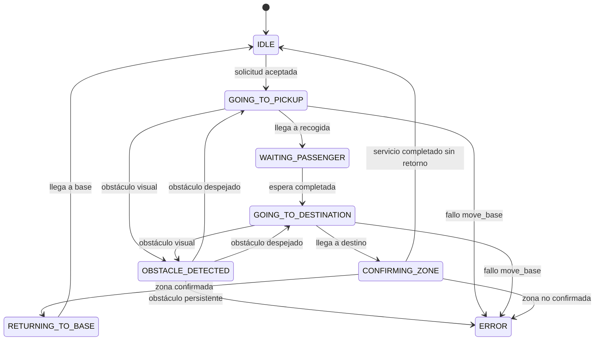

# MWC TaxiBot

Taxi autónomo indoor basado en ROS para un entorno ferial inspirado en el Mobile World Congress.

El paquete implementa una capa de servicio sobre ROS Navigation: recibe solicitudes de taxi, valida zonas, envía objetivos a `move_base`, gestiona una máquina de estados, publica estado del servicio y consume señales visuales simples.

## Componentes

- `taxi_manager_node`: nodo principal. Expone `/request_taxi`, publica `/taxi_status` y controla la lógica del servicio.
- `taxi_core`: librería C++ pura con la máquina de estados y reglas de validación.
- `taxi_request_client`: cliente de terminal para pedir trayectos.
- `vision_perception_node`: interfaz de percepción visual. Publica `/visual_obstacle` y `/zone_detection`.
- `RequestTaxi.srv`: servicio para pedir un trayecto.
- `TaxiStatus.msg`: estado observable del taxi.

## Zonas

Las zonas del recinto están en `config/zones.yaml`:

- `base`
- `entrada`
- `auditorio`
- `stand_robotica`
- `cafeteria`
- `networking`

Cada zona define `x`, `y`, `yaw` y `visual_label`.

## Compilación

Desde la raíz de un workspace Catkin:

```bash
catkin_make
source devel/setup.bash
```

Si este paquete está dentro de `src`, ROS generará automáticamente los mensajes y servicios.

## Ejecución

Primero debe estar activo el robot, el mapa, AMCL u odometría equivalente y un servidor `move_base`.

Lanzar TaxiBot en simulación:

```bash
roslaunch mwc_taxibot mwc_taxibot_sim.launch
```

Lanzar TaxiBot para prueba real:

```bash
roslaunch mwc_taxibot mwc_taxibot_real.launch
```

Solicitar un trayecto:

```bash
rosrun mwc_taxibot taxi_request_client entrada auditorio
```

Consultar el estado:

```bash
rostopic echo /taxi_status
```

Simular un obstáculo visual:

```bash
rostopic pub /visual_obstacle std_msgs/Bool "data: true"
```

Confirmar una zona visual:

```bash
rostopic pub /zone_detection std_msgs/String "data: auditorio"
```

## Máquina de estados



## Alcance de la visión

`vision_perception_node` deja preparada la integración con YOLO, FOMO u otro detector ligero. En esta primera versión ya permite dos modos sencillos:

- Señales simuladas por parámetro para probar la lógica sin cámara.
- Confirmación básica de zona por color en imágenes `rgb8` o `bgr8`: rojo para `ENTRADA`, azul para `AUDITORIO`, verde para `ROBOTICA`, amarillo para `CAFE` y morado para `NETWORKING`.
